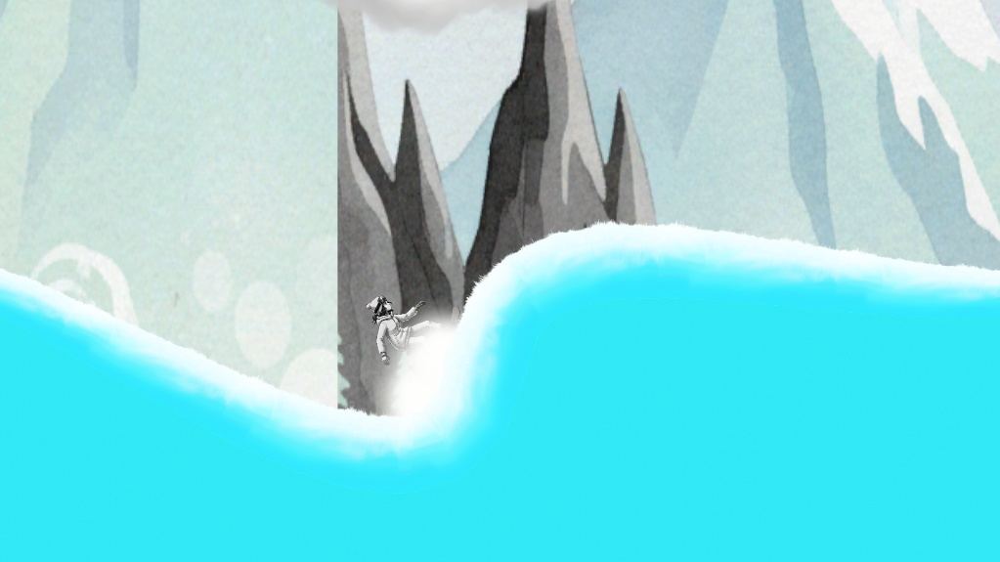

# It Is Snowing Tonight ❄️

A 2D side-scrolling skiing game where you slide down slopes and try to gain speed.

My main focus here was the movement physics. I wanted the momentum to feel right, so when you speed up, it actually feels smooth and heavy.

**Note:** Just like my other projects, I excluded the background music files to avoid copyright issues, but the audio control scripts are still in the folder if you want to take a look.

**Tech:** Unity & C#

